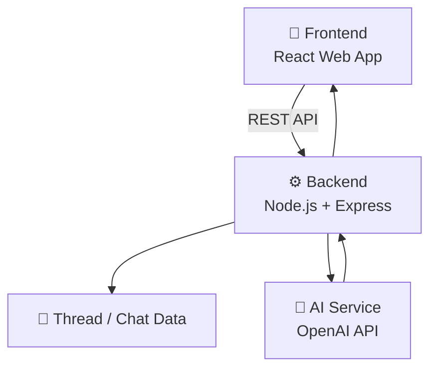

<div align="center">

# Love_GPT

### A full-stack AI chat application with a modern React frontend and an Express-powered backend

<br/>


<br/>

[✨ Features](#-features) •
[🛠️ Tech Stack](#️-tech-stack) •
[🏗️ Architecture](#️-architecture) •
[🚀 Getting Started](#-getting-started) •
[🔮 Roadmap](#-roadmap) •
[👨‍💻 Author](#-author)

</div>

---

## 📖 About

**Love_GPT** is a full-stack, AI-powered chat application that delivers a smooth conversational experience through a clean web interface.

The **frontend** handles the user experience, while the **backend** manages the REST API, chat/thread storage, and communication with the AI service. Keeping them separate makes the project easy to understand, maintain, and extend.

---

## ✨ Features

| | Feature | Description |
|---|---|---|
| 🤖 | **AI Conversations** | Chat with an AI model through a modern web interface |
| 💬 | **Thread Management** | Conversations are organised into threads |
| 🔄 | **Persistent History** | Chat/thread data is handled by the backend |
| ⚡ | **REST API** | Clean, simple API between frontend and backend |
| 🧩 | **Modular Backend** | Separate models, routes, and utilities |
| 🎨 | **Dedicated Frontend** | Standalone React application |

---

## 🛠️ Tech Stack

<table>
  <tr>
    <th>Layer</th>
    <th>Technologies</th>
  </tr>
  <tr>
    <td>🎨 <b>Frontend</b></td>
    <td>React • JavaScript • HTML • CSS</td>
  </tr>
  <tr>
    <td>⚙️ <b>Backend</b></td>
    <td>Node.js • Express.js • REST APIs</td>
  </tr>
  <tr>
    <td>🧠 <b>AI</b></td>
    <td>OpenAI API</td>
  </tr>
  <tr>
    <td>🧰 <b>Tools</b></td>
    <td>Git • GitHub • VS Code</td>
  </tr>
</table>

---

## 🏗️ Architecture



### 📁 Project Structure

```text
Love_GPT/
│
├── 📂 Backend/
│   ├── 📂 models/
│   │   └── Thread.js        # Thread / chat data model
│   ├── 📂 routes/
│   │   └── chat.js          # Chat API routes
│   ├── 📂 utils/
│   │   └── openai.js        # OpenAI integration helper
│   ├── server.js            # Backend entry point
│   ├── package.json
│   └── package-lock.json
│
├── 📂 Frontend/             # React application
│   └── ...
│
├── .gitignore
└── README.md
```

---

## 🚀 Getting Started

### ✅ Prerequisites

- [Node.js](https://nodejs.org/) (v18 or higher recommended)
- npm
- An [OpenAI API key](https://platform.openai.com/api-keys)

### 1️⃣ Clone the repository

```bash
git clone https://github.com/luvmangla05/Love_GPT.git
cd Love_GPT
```

### 2️⃣ Set up the Backend

```bash
cd Backend
npm install
```

Create a `.env` file inside the `Backend` folder:

```env
OPENAI_API_KEY=your_api_key_here
# Add any other variables your server.js needs (e.g. PORT, database URI)
```

Start the server:

```bash
npm start
```

> 💡 The exact command depends on the scripts defined in `Backend/package.json`.

### 3️⃣ Set up the Frontend

Open a **new terminal**:

```bash
cd Frontend
npm install
npm run dev
```

Then open the local URL shown in your terminal (usually `http://localhost:5173`). 🎉

---

## 🔑 Environment Variables

| Variable | Required | Description |
|---|:---:|---|
| `OPENAI_API_KEY` | ✅ | Your OpenAI API key |

> ⚠️ **Never commit your `.env` file or API keys to GitHub.** Make sure `.env` is listed in `.gitignore`.

---

## 🎯 Project Goals

- 🧱 Build a complete AI-powered web application end to end
- 🔌 Practice AI API integration
- 🛣️ Design and develop REST APIs
- 💬 Implement conversation management
- 🔗 Connect a frontend and backend cleanly
- 🧹 Maintain a clean, scalable project structure

---

## 🔮 Roadmap

- [ ] 🔐 User authentication
- [ ] ⚡ Streaming AI responses
- [ ] 🗂️ Improved conversation history
- [ ] 📄 File / document-based conversations
- [ ] 🤖 Multiple AI model support
- [ ] 🛡️ Better error handling
- [ ] ☁️ Deployment & production optimisation
- [ ] 🎨 Enhanced UI/UX

---

## 🤝 Contributing

Contributions, issues, and feature requests are welcome!

1. Fork the project
2. Create your feature branch (`git checkout -b feature/AmazingFeature`)
3. Commit your changes (`git commit -m "Add AmazingFeature"`)
4. Push to the branch (`git push origin feature/AmazingFeature`)
5. Open a Pull Request

---

## 👨‍💻 Author

<div align="center">

**Luv Mangla**

🎓 B.Tech CSE — JSS University, Noida

[](https://github.com/luvmangla05)

</div>

---

<div align="center">

### ⭐ If you like this project, give it a star!

Made with ❤️ by Luv Mangla

</div>
